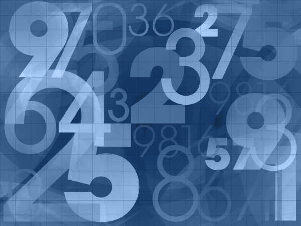

# Activities Overview

Math Resource Studio offers a wide variety of math activities to create engaging worksheets for students of all levels.

## Featured Activity

*Example of a numbers-based activity in Math Resource Studio*

## Available Activities

Math Resource Studio includes dozens of customizable activities covering:

- **Basic Operations** - Addition, subtraction, multiplication, division
- **Fractions** - All fraction operations and concepts
- **Decimals** - Decimal operations and place value
- **Geometry** - Shapes, angles, area, and perimeter
- **Word Problems** - Real-world math applications
- **Time and Money** - Clock reading and currency
- **Measurement** - Units, conversions, and estimation

## Getting Started

1. **Select an activity** from the Activities panel
2. **Configure settings** to match your needs
3. **Preview** your worksheet
4. **Generate** the final worksheet and answer key

---

*Explore each activity to discover the full range of customization options available.*
